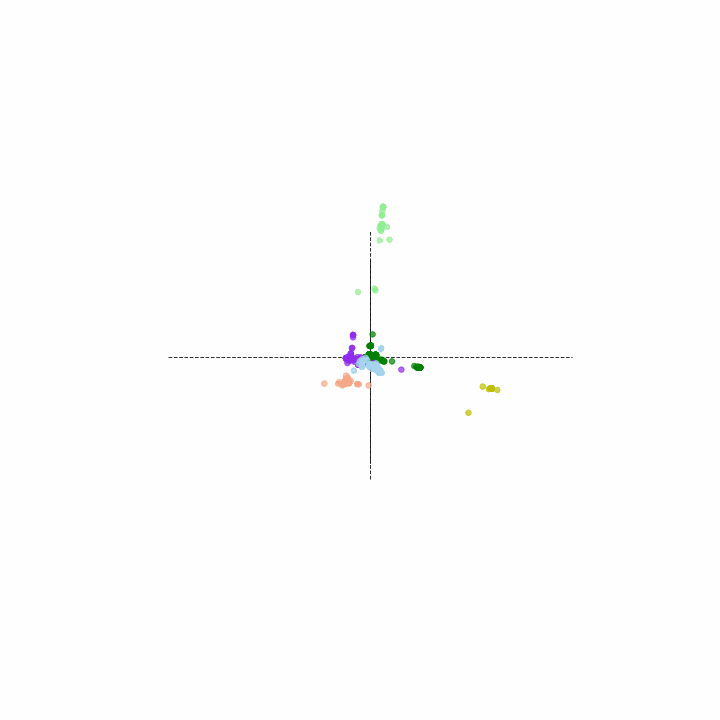

# Tracking the Evolution of the SARS-CoV-2 N Gene using Unsupervised Learning

As SARS-CoV-2 variants continue to emerge and the sea of information describing those variants expands, there is a need to develop more streamlined approaches for interpreting this information. This project describes an approach for creating custom variant designations based on a single gene of interest. This project focuses on understanding the variation in the COVID-19 N gene, which may be of interest to diagnostics companies since many nucleic acid-based tests on the market right now are targeting the N gene as either the sole or primary gene target.

After clustering the preprocessed data using k-means, six N gene clusters were identified. The scatterplot below shows the posititions of the clusters relative to the COVID-19 reference genome (Wuhan-Hu-1 | NC_045512), whose location is at the origin.

---

### Tools Used
- Pandas
- Skikit-Learn
- BioSeq
- Matplotlib

---

### Methods Summary

---

1. **fasta_processing.ipynb** 
    - Convert sequence data in the fasta file format to csv format
    - Filter out all sequences except N gene sequences
    - Convert raw sequences into hexamer 'words' (sliding windows containing 6 base pairs)
2. **dataset_assmbly.ipynb**
    - Undersample sequence submissions from the US and Australia
3. **NLP_cluster.ipynb**
    - Sequence pre-processing using NLP methods
    - Clustering (kmeans, hierarchical)
4. **viz.ipynb**
    - Visualizations of clustered results
